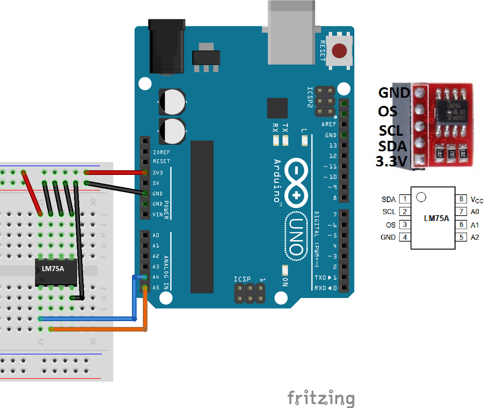

# I2C Temperature Sensor (LM75A) Library for Arduino
   
 
## What is it

This library (with example) is designed to be integrated in projects using LM75A sensors to get temperature.

## How to install

1) Download <a target="_blank" href="https://github.com/QuentinCG/Arduino-LM75A-Temperature-Sensor-Library/releases/download/1.1.0/LM75A_v1_1_0.zip">latest release</a>

2) On your Arduino IDE, click "Sketch" menu and then "Include Library > Add .ZIP Libraries"

3) You can now use the library for your project or launch an example ("File > Examples")

## How to connect the sensor to your Arduino

|LM75A sensor|Arduino                                  |
|--------    |--------                                 |
|VCC         |3.3V                                     |
|GND         |GND                                      |
|SDA         |A4 (SDA)                                 |
|SCL         |A5 (SCL)                                 |
|A0          |GND (or VCC to increase I2C address of 1)|
|A1          |GND (or VCC to increase I2C address of 2)|
|A2          |GND (or VCC to increase I2C address of 4)|
|OS          |None                                     |

## Examples

One example is provided with this library:

### Show temperature in degrees and fahrenheit every second

<a target="_blank" href="https://github.com/QuentinCG/Arduino-LM75A-Temperature-Sensor-Library/blob/master/examples/LM75A_ShowTemperature/LM75A_ShowTemperature.ino">Link to source code</a>

## License

This project is under MIT license. This means you can use it as you want (just don't delete the library header).

## Contribute

If you want to add more examples or improve the library, just create a pull request with proper commit message and right wrapping.

## Contributors

Thank you <a target="_blank" href="https://github.com/andrzejboro">andrzejboro</a> for your help on a bug for negative temperature
